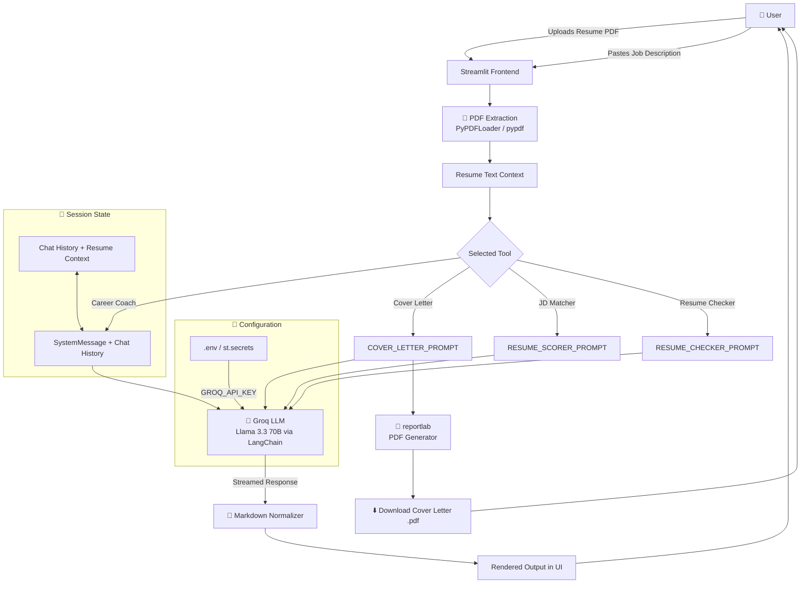

<div align="center">


<br/>

<a href="https://github.com/Biswajitpa">
  
</a>

<br/>
<sub><b>Built by <a href="https://github.com/Biswajitpa">Biswajit Pattanaik</a></b></sub>

<br/>

[](https://git.io/typing-svg)

<br/>

<p>
  
  
  
  
  
</p>

<p>
  
  
  
  
  
  
</p>

<br/>

<p>
  <a href="https://resumegenie-ai-lxixnkbibbpj8r22qcvv7z.streamlit.app/"><b>🚀 Live Demo</b></a> ·
  <a href="../../issues/new?labels=bug">🐞 Report Bug</a> ·
  <a href="../../issues/new?labels=enhancement">✨ Request Feature</a> ·
  <a href="#-getting-started">📦 Quick Start</a>
</p>


</div>

<br/>

## 📖 Table of Contents

<details open>
<summary>Click to expand</summary>

- [🧞 About the Project](#-about-the-project)
- [❓ Why Resume Genie](#-why-resume-genie)
- [✨ Features](#-features)
- [🛠 Tech Stack](#-tech-stack)
- [🏗 System Design](#-system-design)
- [⚙️ How It Works](#️-how-it-works)
- [📸 Screenshots](#-screenshots)
- [🚀 Getting Started](#-getting-started)
- [📁 Project Structure](#-project-structure)
- [☁️ Deployment](#️-deployment)
- [🎨 Design Language](#-design-language)
- [🗺 Roadmap](#-roadmap)
- [❔ FAQ](#-faq)
- [🤝 Contributing](#-contributing)
- [📄 License](#-license)
- [👤 Created & Maintained By](#-created--maintained-by)

</details>

<br/>

## 🧞 About the Project

**Resume Genie** is an all-in-one, AI-powered career toolkit built with **Streamlit** and **Groq's Llama 3.3 70B** model. It takes the guesswork out of job applications by combining four focused tools into a single, fast, distraction-free workspace.

> Upload your resume once. Get a tailored cover letter, an honest ATS match score, a standalone resume audit, and a career coach that actually knows your background — all powered by Groq's LPU inference, which means you're not staring at a spinner for 30 seconds per response.

Built for job seekers who are tired of generic "add more keywords" advice from tools that never actually read the job description they're applying to.

<br/>

## ❓ Why Resume Genie

| Generic AI Resume Tools | Resume Genie |
|---|---|
| ❌ One-size-fits-all templates | ✅ Every output is generated fresh from *your* resume + *that specific* job description |
| ❌ Slow, laggy inference (10–30s+ waits) | ✅ Groq LPU inference — streaming responses in real time |
| ❌ Vague "improve your resume" feedback | ✅ Structured scoring: keywords matched, ATS compatibility, readability, skill gaps |
| ❌ No memory between tools | ✅ Career Coach chat retains full resume context across the conversation |
| ❌ Cover letters that sound like everyone else's | ✅ Grounded strictly in your actual resume — no invented experience |
| ❌ Locked behind a subscription paywall | ✅ Open source, self-hostable, bring your own free-tier API key |

<br/>

## ✨ Features

<table>
<tr>
<td width="50%" valign="top">

### ✉️ Cover Letter Generator
Generates a tailored, 300–450 word cover letter matched precisely to a job description. Streams live as it writes, then exports as a clean, print-ready **PDF** — not just a `.md` dump.

</td>
<td width="50%" valign="top">

### 📊 Resume-JD Matcher
Scores your resume against a specific job posting: overall match %, keyword match/gap analysis, ATS compatibility score, readability score, and prioritized improvement suggestions.

</td>
</tr>
<tr>
<td width="50%" valign="top">

### 🔍 Standalone Resume Checker
Evaluates your resume on its own merits — no job description required. Surfaces strengths, weaknesses, skills detected, skills worth adding, and realistic next career steps.

</td>
<td width="50%" valign="top">

### 💬 Career Coach Chatbot
A persistent, resume-aware chat session. Ask about interview prep, career pivots, negotiation, or skill development — the model has full context of your background throughout.

</td>
</tr>
</table>

**Plus:**
- ⚡ **Groq-powered inference** — Llama 3.3 70B with near-instant token streaming
- 🎨 **Custom enterprise UI** — hand-built dark theme, signature motion design, zero default-Streamlit look
- 🔒 **Secrets handled properly** — `.env` locally, `st.secrets` in production, nothing hardcoded
- 📄 **Real PDF parsing and generation** — not just plain-text hacks
- 🧠 **Markdown safety net** — normalizes inconsistent LLM formatting into clean, renderable output

<br/>

## 🛠 Tech Stack

<div align="center">


</div>

| Layer | Technology | Purpose |
|---|---|---|
| **Frontend / UI** | Streamlit + custom CSS | App shell, layout, and a fully custom dark enterprise theme (Sora / Inter / IBM Plex Mono) |
| **LLM Orchestration** | LangChain (`langchain-core`, `langchain-community`, `langchain-groq`) | Prompt templates, chains, message history |
| **Inference Provider** | Groq — Llama 3.3 70B Versatile | Ultra-low-latency LPU inference for streaming responses |
| **PDF Parsing** | `pypdf`, `PyPDFLoader` | Extracts resume text from uploaded PDFs |
| **PDF Generation** | `reportlab` | Renders the generated cover letter into a downloadable, print-ready PDF |
| **Config / Secrets** | `python-dotenv`, `st.secrets` | Local `.env` support + Streamlit Cloud secrets fallback |
| **Image Handling** | Pillow | Sidebar logo rendering |

<br/>

## 🏗 System Design



**Flow summary:**
1. User uploads a resume (PDF) and, where relevant, pastes a job description.
2. The PDF is parsed into raw text via `PyPDFLoader`, cached with `@st.cache_data` so re-runs don't re-parse.
3. Based on the active tool, a dedicated prompt template is filled with the resume text (and job description, if applicable).
4. The prompt is sent to **Groq's Llama 3.3 70B** model via LangChain, streamed token-by-token into the UI.
5. A markdown-normalization pass cleans up inconsistent bullet/formatting behavior from the model before rendering.
6. For the Cover Letter tool, the final text is also piped through `reportlab` to produce a downloadable PDF.
7. The Career Coach tool persists chat history + resume context in `st.session_state` across turns.

<br/>

## ⚙️ How It Works

```
1️⃣  Upload your resume (PDF)
        ↓
2️⃣  Pick a tool from the sidebar
        ↓
3️⃣  (Optional) Paste a job description
        ↓
4️⃣  Click Generate / Score / Evaluate
        ↓
5️⃣  Groq streams the response live
        ↓
6️⃣  Download as PDF or keep chatting
```

<br/>

## 📸 Screenshots

<div align="center">

| Cover Letter Generator | Resume-JD Matcher |
|:---:|:---:|
| _add screenshot here_ | _add screenshot here_ |

| Resume Checker | Career Coach Chat |
|:---:|:---:|
| _add screenshot here_ | _add screenshot here_ |

</div>

<br/>

## 🚀 Getting Started

### Prerequisites

- Python **3.11+**
- A free [Groq API key](https://console.groq.com/keys)
- `pip` and `venv`

### Installation

```bash
# 1. Clone the repository
git clone https://github.com/yourusername/resume-genie.git
cd resume-genie

# 2. Create and activate a virtual environment
python -m venv venv

# Windows
venv\Scripts\activate

# macOS/Linux
source venv/bin/activate

# 3. Install dependencies
pip install -r requirements.txt
```

### Environment Variables

Create a `.env` file in the project root:

```env
GROQ_API_KEY=your-groq-api-key-here
```

> ⚠️ **Never commit your `.env` file.** It's already excluded via `.gitignore`. If a key is ever exposed (pasted in chat, screenshot, commit history), revoke and regenerate it immediately in the [Groq console](https://console.groq.com/keys).

### Running Locally

```bash
python -m streamlit run main_dashboard.py
```

The app opens at `http://localhost:8501`.

<br/>

## 📁 Project Structure

```
resume-genie/
├── main_dashboard.py      # Main Streamlit app — all 4 tools, UI, and logic
├── logo.png               # Sidebar branding logo
├── requirements.txt       # Python dependencies
├── .env                   # Local secrets (GROQ_API_KEY) — not committed
├── .gitignore
└── README.md
```

<br/>

## ☁️ Deployment

This app is deployed on **Streamlit Community Cloud**.

| Step | Action |
|---|---|
| 1 | Push your repository to GitHub (excluding `.env`) |
| 2 | Go to [share.streamlit.io](https://share.streamlit.io) and sign in with GitHub |
| 3 | Click **New app** → select this repo → branch `main` → file `main_dashboard.py` |
| 4 | Under **Advanced settings → Secrets**, add `GROQ_API_KEY = "your-key-here"` |
| 5 | Click **Deploy** 🚀 |

Your app will be live at a URL like `https://resume-genie-yourname.streamlit.app`.

<br/>

## 🎨 Design Language

Resume Genie ships with a fully custom, hand-built dark theme — not a Streamlit default:

| Token | Value | Role |
|---|---|---|
| 🌑 Ink | `#0B0E14` | Base background |
| 🗂 Surface | `#12161F` | Card / panel background |
| ✒️ Text Primary | `#ECEEF2` | Headlines, body |
| 🔵 Accent | `#2F5CFF` | Primary actions |
| 🟡 Accent Gold | `#C9A24B` | Verification, premium accents |
| 🟢 Good | `#21C08A` | Success states, high scores |

**Typography:** `Sora` for headlines and navigation, `Inter` for body text, `IBM Plex Mono` for data, scores, and status labels.

**Signature motif:** a paper-plane animation arcs across the hero once per load — a literal visualization of a resume "taking flight" toward its destination.

<br/>

## 🗺 Roadmap

- [ ] LinkedIn profile import
- [ ] Multi-resume comparison mode
- [ ] Export resume checker results as PDF
- [ ] Support additional file formats (`.docx`)
- [ ] User accounts + saved history
- [ ] Multi-language resume support

See the [open issues](../../issues) for the full list of proposed features and known issues.

<br/>

## ❔ FAQ

<details>
<summary><b>Is my resume data stored anywhere?</b></summary>
<br/>
No. Resume text is processed in-memory for the duration of your session and is not persisted to a database.
</details>

<details>
<summary><b>Do I need a paid API key?</b></summary>
<br/>
No — Groq offers a generous free tier that's sufficient for personal use and demos.
</details>

<details>
<summary><b>Can I use a different LLM provider?</b></summary>
<br/>
Yes. The app is built on LangChain, so swapping <code>ChatGroq</code> for <code>ChatOpenAI</code>, <code>ChatAnthropic</code>, or any other LangChain-supported chat model is a small, contained change.
</details>

<details>
<summary><b>Why does the cover letter download as a PDF instead of Markdown?</b></summary>
<br/>
Because that's what you actually send to a hiring manager. The PDF is generated on the fly with <code>reportlab</code> from the model's raw text output.
</details>

<br/>

## 🤝 Contributing

Contributions make the open-source community amazing. Any contributions are **greatly appreciated**.

```bash
# 1. Fork the repo
# 2. Create your feature branch
git checkout -b feature/AmazingFeature

# 3. Commit your changes
git commit -m "Add AmazingFeature"

# 4. Push to the branch
git push origin feature/AmazingFeature

# 5. Open a Pull Request
```

<br/>

## 📄 License

Distributed under the **MIT License**. See `LICENSE` for more information.

<br/>

## 👤 Created & Maintained By

<div align="center">


<br/><br/>

[](https://github.com/Biswajitpa)

<br/>

**Biswajit Pattanaik**

*Building AI-powered agentic systems, one workflow at a time* 🚀

[@Biswajitpa](https://github.com/Biswajitpa)

<br/>

⭐ If this project helped you, consider giving it a star — it goes a long way!
<br/>
🐛 Found a bug or have an idea? Issues and pull requests are always welcome.
<br/>
💛 Open to feedback, collaboration, and discussion.

</div>

<br/>

<div align="center">

### ⭐ If this project helped you, consider giving it a star!


</div>
