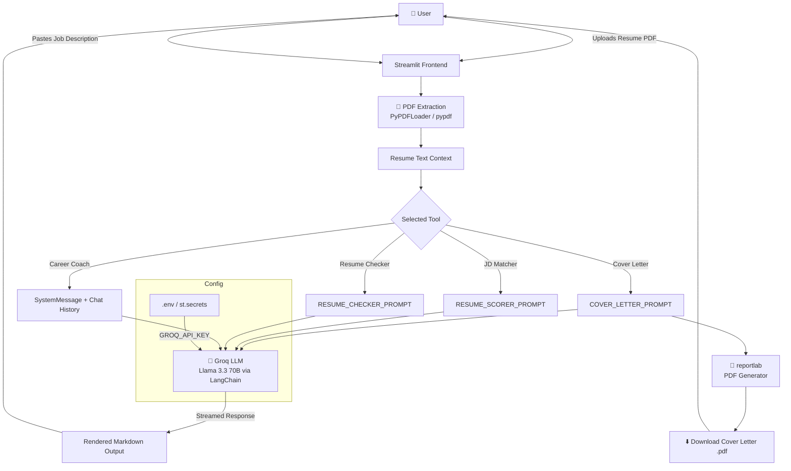

<div align="center">


<br/>

[](https://git.io/typing-svg)

<br/>


<br/>

**[🚀 Live Demo](https://resume-genie.streamlit.app)** · **[🐞 Report Bug](../../issues)** · **[✨ Request Feature](../../issues)**

</div>

<br/>

## 📖 Table of Contents

- [About the Project](#-about-the-project)
- [Features](#-features)
- [Tech Stack](#-tech-stack)
- [System Design](#-system-design)
- [Screenshots](#-screenshots)
- [Getting Started](#-getting-started)
  - [Prerequisites](#prerequisites)
  - [Installation](#installation)
  - [Environment Variables](#environment-variables)
  - [Running Locally](#running-locally)
- [Project Structure](#-project-structure)
- [Deployment](#-deployment)
- [Roadmap](#-roadmap)
- [Contributing](#-contributing)
- [License](#-license)
- [Contact](#-contact)

<br/>

## 🧞 About the Project

**Resume Genie** is an all-in-one, AI-powered career toolkit built with **Streamlit** and **Groq's Llama 3.3 70B** model. It takes the guesswork out of job applications by combining four focused tools into a single, fast workspace:

> Upload your resume once. Get a tailored cover letter, an honest ATS match score, a standalone resume audit, and a career coach that actually knows your background — all in one place, all powered by blazing-fast Groq inference.

Built for job seekers who are tired of generic advice and want AI feedback that's specific to *their* resume and *their* target role.

<br/>

## ✨ Features

| | Feature | Description |
|---|---|---|
| ✉️ | **Cover Letter Generator** | Generates a tailored, 300–450 word cover letter matched exactly to a job description, exportable as a polished PDF |
| 📊 | **Resume-JD Matcher** | Scores your resume against a job description — keyword match, ATS compatibility, readability, and a skill gap analysis |
| 🔍 | **Standalone Resume Checker** | Evaluates your resume on its own merits: clarity, structure, strengths, weaknesses, and recommended next steps |
| 💬 | **Career Coach Chatbot** | A persistent chat session that has full context of your resume — ask about interviews, career pivots, or skill gaps |
| ⚡ | **Groq-Powered Inference** | Uses Groq's LPU inference engine for near-instant streaming responses, even on long documents |
| 🎨 | **Custom Enterprise UI** | Hand-built dark theme with signature motion design — no default Streamlit look |

<br/>

## 🛠 Tech Stack

<div align="center">

  

| Layer | Technology |
|---|---|
| **Frontend / UI** | Streamlit, custom CSS (Sora, Inter, IBM Plex Mono) |
| **LLM Orchestration** | LangChain (`langchain-core`, `langchain-community`, `langchain-groq`) |
| **Inference Provider** | Groq (Llama 3.3 70B Versatile) |
| **PDF Parsing** | `pypdf`, `PyPDFLoader` |
| **PDF Generation** | `reportlab` |
| **Config / Secrets** | `python-dotenv`, `st.secrets` |
| **Image Handling** | Pillow |

</div>

<br/>

## 🏗 System Design



**Flow summary:**
1. User uploads a resume (PDF) and, where relevant, pastes a job description.
2. The PDF is parsed into raw text using `PyPDFLoader`.
3. Based on the selected tool, a specific prompt template is filled with the resume text (and job description, if applicable).
4. The prompt is sent to **Groq's Llama 3.3 70B** model via LangChain, streamed back token-by-token for a responsive UI.
5. Output is rendered as Markdown in the app — and, for the Cover Letter tool, also converted into a downloadable PDF via `reportlab`.
6. The Career Coach tool maintains a persistent chat history in Streamlit's session state, so the model has full conversational + resume context across turns.

<br/>

## 📸 Screenshots

<div align="center">

| Cover Letter Generator | Resume-JD Matcher |
|---|---|
| _add screenshot here_ | _add screenshot here_ |

| Resume Checker | Career Coach Chat |
|---|---|
| _add screenshot here_ | _add screenshot here_ |

</div>

<br/>

## 🚀 Getting Started

### Prerequisites

- Python 3.11 or higher
- A free [Groq API key](https://console.groq.com/keys)
- `pip` and `venv`

### Installation

```bash
# Clone the repository
git clone https://github.com/yourusername/resume-genie.git
cd resume-genie

# Create and activate a virtual environment
python -m venv venv

# Windows
venv\Scripts\activate

# macOS/Linux
source venv/bin/activate

# Install dependencies
pip install -r requirements.txt
```

### Environment Variables

Create a `.env` file in the project root:

```env
GROQ_API_KEY=your-groq-api-key-here
```

> ⚠️ Never commit your `.env` file. It's already excluded via `.gitignore`.

### Running Locally

```bash
python -m streamlit run main_dashboard.py
```

The app will open at `http://localhost:8501`.

<br/>

## 📁 Project Structure

```
resume-genie/
├── main_dashboard.py      # Main Streamlit app — all 4 tools, UI, and logic
├── logo.png               # Sidebar branding logo
├── requirements.txt       # Python dependencies
├── .env                   # Local secrets (GROQ_API_KEY) — not committed
├── .gitignore
└── README.md
```

<br/>

## ☁️ Deployment

This app is deployed on **Streamlit Community Cloud**.

1. Push your repository to GitHub (excluding `.env`)
2. Go to [share.streamlit.io](https://share.streamlit.io) and sign in with GitHub
3. Click **New app** → select this repo, branch `main`, file `main_dashboard.py`
4. Under **Advanced settings → Secrets**, add:
   ```toml
   GROQ_API_KEY = "your-groq-api-key-here"
   ```
5. Click **Deploy** 🚀

<br/>

## 🗺 Roadmap

- [ ] Add LinkedIn profile import
- [ ] Multi-resume comparison mode
- [ ] Export resume checker results as PDF
- [ ] Support additional file formats (.docx)
- [ ] User accounts + history persistence

See [open issues](../../issues) for a full list of proposed features.

<br/>

## 🤝 Contributing

Contributions make the open-source community amazing. Any contributions are **greatly appreciated**.

1. Fork the repo
2. Create your feature branch (`git checkout -b feature/AmazingFeature`)
3. Commit your changes (`git commit -m 'Add some AmazingFeature'`)
4. Push to the branch (`git push origin feature/AmazingFeature`)
5. Open a Pull Request

<br/>

## 📄 License

Distributed under the MIT License. See `LICENSE` for more information.

<br/>

## 📬 Contact

**Satyajit** — feel free to reach out via GitHub Issues for questions or feedback.

Project Link: [https://github.com/yourusername/resume-genie](https://github.com/yourusername/resume-genie)

<br/>

<div align="center">


</div>
